# Ripple: architecture

## Project identification

- **Name**: Ripple
- **Purpose**: treats a screenplay as a production database rather than a static document: imports it, extracts a graph of production entities and evidence-backed assertions, and shows the downstream production and continuity impact of a proposed edit before anything is applied
- **License**: AGPL-3.0
- **Repository**: `github.com/shehuphd/ripple`
- **Runtime**: Python 3.11+, FastAPI + Jinja2 + vanilla JS, SQLAlchemy 2 over SQLite (local) or PostgreSQL (deployed)

## Project structure

```
ripple/
├── ripple/
│   ├── adapters/       # Format detection and parsing: Fountain, FDX, PDF, plain text
│   ├── config/         # Local credential storage (ripple/config/secrets.py)
│   ├── db/             # SQLAlchemy models, session/engine, naming, repository queries
│   ├── extraction/     # The scene → entities/assertions LLM pipeline: prompt, service, validation, judgement
│   ├── graph/          # Deterministic, model-free: diff engine, continuity retrieval, 2D layout, predicate rules
│   ├── llm/            # Provider contract, the KeyCall adapter, the google-genai adapter
│   ├── services/       # Preview engine, change-set service, spend ledger, settings, synthesizer
│   ├── web/            # FastAPI app, Jinja2 templates, static CSS/JS
│   └── tracing.py      # TraceAct configuration
├── tests/              # pytest, one file per module above plus adversarial/integration tests
├── tools/              # Developer commands (render_screenplay.py, seed_graph.py,
│                      #   restate_findings.py)
├── demo-scripts/       # Bundled screenplay corpus, each with an expected-output dependencies.md
└── data/               # Runtime state: sqlite db, secrets.env, traces/ (gitignored)
```

## High-level system diagram

```mermaid
flowchart LR
    Upload["Upload\n.fountain / .fdx / .pdf / .txt"] --> Detect[Format detection]
    Detect --> Adapter["Adapter: parse into\nscenes and units"]
    Adapter --> DB[("Script / Scene /\nScriptUnit")]

    DB --> Extract[Extraction service]
    Extract -->|Gemini, via KeyCall| Model[LLM call]
    Model --> Validate["Schema validation\n+ predicate rules"]
    Validate --> Graph[("Entity / Assertion /\nEntityAttribute")]

    Graph --> Preview["Edit lines:\nripple preview"]
    Preview -->|Gemini, via KeyCall| Judge["Judgement:\nverdict per stored item"]
    Judge --> Diff["Deterministic\ndiff engine"]
    Preview --> Continuity["Deterministic\ncontinuity retrieval"]
    Continuity -->|Gemini, via KeyCall| ContJudge["Continuity judgement:\nconflicts from cited evidence"]
    ContJudge --> Report
    Diff --> Synth[Synthesizer]
    Continuity --> Synth
    Synth --> Report["Ripple report\n+ findings"]

    Diff --> ChangeSet["Change-set service\natomic accept / undo"]
    Report --> ChangeSet
    ChangeSet -->|accept| Graph
    ChangeSet -->|undo| Graph
```



The model is called for extraction, the preview's judgement and continuity passes, the opt-in prose explanation, and the grounded query; everything else (detection, parsing, the diff, continuity retrieval, layout, severity) is deterministic application code, so the diff and the orphaned-reference finding hold even with no provider configured. The continuity judgement is advisory: when its call fails, the preview stands on the deterministic findings and says so. Every model call, refusal included, is written to the `model_calls` audit table.

## STRuFO

[S]hape, [T]echnical stack, [Ru]n details, [F]ailure modes, [O]bservability.

### Shape

Ripple treats a screenplay as a production database, not a static document. It imports a script, extracts a graph of production entities and evidence-backed assertions, and shows the downstream production and continuity impact of a proposed edit before anything is applied. The loop is: select a line, inspect its graph, edit it, see the ripple, decide.

### Technical stack

- **Language:** Python 3.11+
- **Web:** FastAPI + Jinja2 templates + vanilla JS, no build step
- **Data:** SQLAlchemy 2 over SQLite locally (`data/ripple.db`), PostgreSQL when deployed; 25 tables with CHECK constraints enforcing every enumerated vocabulary at the database layer
- **`keycall`:** the LLM adapter behind extraction, the preview's judgement and continuity passes, and the prose explanation, for its native schema enforcement and typed errors
- **`google-genai`:** Google's own SDK, behind the grounded query (Ask the graph) only, so a Google Cloud SDK generation is imported and called at runtime; same credential and model ids as the KeyCall path, mapped to the same `GenerationResult`
- **`traceact`:** startup-configured tracing with `capture_inputs=False`, so screenplay text and uploaded bytes are never captured automatically
- **`rates`:** pricing ledger behind every dollar figure
- **`pdf-inspector` / `defusedxml`:** PDF and Final Draft XML parsing; optional `tesseract` + `pdftoppm` for OCR of scanned PDFs
- **Deterministic core (no model):** format detection, parsing, the diff engine, continuity retrieval, 2D layout, and severity are all plain application code, so the diff and the orphaned-reference finding hold with no provider configured

### Run details

#### Plain-English version

You upload a screenplay and Ripple reads it into a web of who and what each scene depends on: characters, props, wardrobe, vehicles, locations, every fact backed by the line that stated it. Then you change a line. Before anything is saved, Ripple shows you what that change knocks over downstream: the prop that's now in two places at once, the character named in a scene that no longer introduces them. You look at the ripple, then decide whether to accept it.

#### Technical version

**Setup (build the graph).** An upload is format-detected from its bytes, parsed into `ParsedScene`/`ParsedUnit`, and written as scripts/scenes/units. `extraction/service.py` then runs one scene at a time through the model: a deterministic pre-pass writes what code can derive (cast from dialogue cues, location from the heading) with `provenance="system"`, the model reads the rest, `validate.py` checks the JSON against the schema and predicate rules before any row is written, and entities/assertions/attributes are written to the graph. Extraction resumes per scene rather than restarting a whole run, and unchanged scenes replay from cache at no cost. `extraction/worker.py` drains the run in a thread while the page polls, so a build outlives the tab that started it. The run panel's Cancel stops a build after the scene in flight, and a rebuild forces the run past the cache when the parser or pre-pass has improved since the last build.

**The unit of work (one edit → ripple → accept).** You edit a line and press See ripple. `preview_changes` opens a `ripple.preview` traceact span and, for each affected scene, sends the model the stored assertions and attributes those edited lines support. `judge.py` verifies the returned verdicts in code: unlisted ids are dropped, a `holds` on deleted evidence is downgraded, a missing verdict is a coverage miss. An advisory continuity pass runs over a bounded evidence packet, every claimed conflict required to cite evidence ids from that packet. The deterministic `diff.py` compares assertion sets by edge identity (both endpoints plus predicate), so a proposed-but-unsaved assertion still compares correctly, and the synthesizer writes the plain-language explanation. Nothing is applied yet. On accept, `changeset.py` turns the diff and its findings into one atomic change set, applied in a single transaction, with latest-only undo. Every model call, refusals included, is written to the `model_calls` audit table.

### Failure modes

| Failure | Trigger | Handling |
|---|---|---|
| Malformed / truncated response | Model returns unparseable or cut-off JSON during extraction | Escalates to the configured fallback model within the same billed pass; if the fallback also fails, the scene fails (recorded), and the rest of the run continues |
| Empty answer on a scene with content | Model returns no entities for a scene that has text | Treated as a validation failure and escalated to the fallback |
| Budget cap reached | `check_budget` sees the cap hit before provider contact | Raises `BudgetExceeded`, writes the refusal to `model_calls` so billed-but-refused is still visible, fails the scene `budget_exceeded` |
| Dead model | Provider reports a model doesn't exist | Model selection refuses it and Settings marks it, so it's never offered again |
| Quota exhaustion | Provider quota error mid-run | Persistent warning badge on that key in Settings, cleared when the key is updated |
| Continuity call fails | The advisory continuity judgement errors | Preview stands on the deterministic findings and says the continuity pass didn't run |
| No model configured | No provider key / model selected | Import, reader, diff, and deterministic continuity findings all still work; only graph building is disabled |
| Crash mid-build | Server stops during extraction | Per-scene resume on restart, never a restart from zero; the worker dies with the process and the run resumes when a page asks for it again |
| Cancelled build | Cancel then Confirm on the run panel | The loop stops after the scene in flight; the run closes as cancelled and its pending cache rows are deleted, so the next build resumes from the completed scenes and bills only the rest |

### Observability

- Each build, preview, and accept opens its own `traceact` span; the Traces page tables every model call newest-first with purpose, model, script, tokens, cost, duration, and outcome, sorts on any of those columns, and can launch traceact's full viewer pre-filtered to a run.
- The `model_calls` audit table records every call including refusals, so billed tokens are never invisible to the budget gate.
- Each run record carries a priced ledger; every act and estimate states the date of the `rates` price snapshot in use, and shows a dash rather than a wrong number when a model is unpriced.
- Continuity findings, change sets, and reports are all queryable list pages, so the "why did the graph change" trail is on record, not just the fact that it did.

## Core components

| Component | Role |
|---|---|
| `ripple/adapters/` | One contract (`base.py`) across four format adapters: detect a format from content (never a filename), parse into `ParsedScene`/`ParsedUnit`, and return a typed `ImportResult`. Adapters never write to the database. |
| `ripple/extraction/` | `prompt.py` builds the per-scene prompt, holds `OUTPUT_SCHEMA`, and fingerprints both into the cache key; `service.py` runs one scene through the model, resuming per-scene rather than restarting a whole run; `validate.py` checks the model's JSON against the schema and the predicate-signature rules before any row is written; `judge.py` verifies a preview's verdicts in code, dropping unlisted ids, downgrading `holds` on deleted evidence, and treating a missing verdict as a coverage miss. `continuity_judge.py` is the continuity pass's contract: prompt, schema, and verification, with every claimed conflict required to cite evidence ids from the packet. |
| `ripple/graph/` | `diff.py` compares two assertion sets by edge identity (both endpoints plus predicate), not row identity, so a proposed-but-unsaved assertion still compares correctly; `continuity.py` retrieves the bounded evidence packet the continuity judgement consumes and computes the one finding that needs no model (an edit removing an entity's only `establishes` edge while later scenes still reference it); `layout.py` is a fixed, deterministic 2D layout (focus at centre, scenes on a spine, entities in per-department wedges) rather than a force simulation, so two renders of the same graph match; `predicates.py` is the shared vocabulary both the schema and the diff read from; `fixtures.py` builds judge-visible scene context for the preview prompt. |
| `ripple/llm/` | `base.py` is the provider contract (`ModelInfo`, `GenerationResult`, `ProviderError`) plus provider-agnostic helpers (`infer_tier`, `is_text_model`); `keycall_provider.py` is the adapter behind extraction and judgement, backed by [KeyCall](https://pypi.org/project/keycall); `genai_provider.py` is the [google-genai](https://pypi.org/project/google-genai) adapter behind the Ask path, so a Google SDK generation runs at runtime; `fixture.py` is a deterministic test double that never touches a network. |
| `ripple/services/` | `authoring.py` is the writing surface: it creates and renames a script, types a written line by its marker or its position, guards the direct save and delete behind the judgement engine when a fact cites the line, retypes a character cue that never received a speech, and exports the script as Fountain that imports back as itself; `preview.py` is the judgement engine: it sends the model the stored assertions and attributes the edited lines support, validates the verdicts through `judge.py`, replays an identical pending judge call from the audit table at no cost, runs the advisory continuity pass over the evidence packet, and links every call to the proposal it produced; `changeset.py` turns a diff and its findings into an atomic accept/reject/undo, with latest-only undo; `spend.py` is the token ledger and the hard budget gate every call site checks before contacting the provider; `settings.py` handles credential entry, validation, and main/fallback model selection; `synthesizer.py` writes the plain-language ripple explanation from the diff and findings, with a deterministic fallback when no model is configured. |
| `ripple/db/` | SQLAlchemy models for the 25 tables (scripts, scenes, units, entities, aliases, attributes, distinctions, assertions, extraction runs, change sets, findings, evidence, reports, conversations and their turns, query log, model-call audit, budget, UI preferences, app configuration), with CHECK constraints enforcing every enumerated vocabulary at the database layer. `session.py` enforces SQLite foreign keys per connection, turns on write-ahead logging for a file-backed database, and provides the transactional `session_scope` every write path uses. |
| `ripple/web/` | FastAPI routes, Jinja2 templates, and static CSS/JS for the library, reader (reading, writing, and editing in the same lines), ripple preview, settings, graph views, grounded query, and the list pages (entities, assertions, reports, findings, traces). No frontend build step; plain JS files served directly. |
| `ripple/tracing.py` | Configures TraceAct once at startup: `capture_inputs=False` (screenplay text and uploaded bytes are never captured automatically), redaction presets for AI prompts, API keys, HTTP, filesystem paths, and env vars. |

## Data stores

| Store | Used for | Notes |
|---|---|---|
| SQLite (`data/ripple.db`) | Default, and every test | `ripple/db/session.py` turns on `PRAGMA foreign_keys` per connection, since SQLite ignores them otherwise. |
| PostgreSQL | The deployed Replit instance | Same SQLAlchemy models as SQLite; `DATABASE_URL` selects it, and a legacy `postgres://` scheme is rewritten to `postgresql+psycopg://`. |
| `data/secrets.env` (local file, mode `0600`) | A provider credential entered in Settings, outside Replit | Never the database; `ripple/config/secrets.py` refuses to write it at all when running on Replit, where Replit Secrets is the only durable store. `RIPPLE_SECRETS_PATH` overrides the location, which is how the test suite isolates itself from a developer's live key. |
| `data/traces/traces.jsonl` | TraceAct execution traces | Rotates at 8 MiB. |

The database never holds a credential: `AppConfiguration` stores only the selected provider and model identifiers. The `model_calls` table is the application's own audit of every provider contact (prompt, reply, tokens, duration, outcome), deleted with its script; it is application data, distinct from TraceAct's redacted operational traces.

## External integrations

| Integration | Purpose | Scope |
|---|---|---|
| [KeyCall](https://pypi.org/project/keycall) | Credential validation, model listing, and text generation against Google Gemini | The only provider registered at runtime (`ripple/llm/__init__.py`). KeyCall talks to the provider directly over HTTP; no vendor SDK is a dependency. |
| [TraceAct](https://github.com/traceact/traceact) | Execution tracing for import, extraction, preview, accept, undo, and grounded query | Configured once in `ripple/tracing.py`; disabled in tests via `RIPPLE_TRACING=off`. |
| [traceact-browser](https://github.com/traceact/traceact-browser) | Frontend visibility during development | A developer tool, not a runtime dependency; not in `pyproject.toml`. |
| `tesseract` / `pdftoppm` (poppler) | OCR for scanned PDFs | Optional system binaries, checked at launch; a scanned PDF is rejected with a stated reason when they're absent rather than silently mis-parsed. |

## Deployment and infrastructure

Local development runs through `launch.command`, which terminates any Ripple server already running (a stale instance is never reused), verifies Python 3.11+, creates or repairs `.venv`, marks the virtual environment and `data/` as ignored by Dropbox sync, installs the app in editable mode, and starts `uvicorn` on the first free port from 8420. A port held by another Ripple instance is taken over; a port held by anything else is skipped. Only `launch.command` exists today; `launch.sh` and `launch.bat` don't yet.

The deployment target is Replit Starter Autoscale, which supplies `DATABASE_URL` (PostgreSQL) and holds provider credentials in Replit Secrets. The application hasn't been deployed there yet.

## Security considerations

- **Credentials never reach the database or the browser.** `AppConfiguration` stores only provider and model identifiers; `ripple/services/settings.py` validates a candidate key by passing it directly to the provider's model listing, never by writing it into the process environment, and discards it rather than persisting an unvalidated one.
- **Local credential storage is owner-only.** `data/secrets.env` is written at mode `0600`, and writes are refused entirely on Replit, where the deployment filesystem doesn't survive a redeploy.
- **Screenplay content is never captured automatically.** `TraceConfig(capture_inputs=False, capture_outputs=False)` plus the `ai_prompts`, `api_keys`, `http`, `filesystem_paths`, and `env_vars` redaction presets keep prose, filenames, and uploaded bytes out of trace records; call sites pass counts, hashes, and codes explicitly instead.
- **Local key validation is format-blind by design.** `unusable_credential()` only refuses what cannot be a credential at all (non-text, oversized, binary), never a prefix or length guess, because a wrong local rejection is worse than the provider's own error.
- **Spend is bounded.** The budget gate in `ripple/services/spend.py` refuses every call site before provider contact once the recorded token total reaches the configured cap, and refusals are audited without token counts so they cannot compound the spend.

## Development and testing

- `./launch.command --test` runs the suite; `.venv` is the one environment the app, the tests, and the tools run in.
- `pytest` with `pytest-randomly` left enabled and declared in `required_plugins`: a failure caused by test order is treated as a bug, not hidden by pinning order.
- `tests/support/fixture_provider.py` provides a deterministic, no-network provider for extraction, preview, and agent tests, so the pipeline is exercised without spending a credential. It lives with the tests; the shipped package never imports it.
- The web fixtures point `RIPPLE_SECRETS_PATH` at an empty file, so the suite can never read or repopulate a developer's live key.
- Linting: `ruff` (defaults plus import order, bugbear, modern syntax, and ruff's own checks). Formatting: `black`.
- `demo-scripts/` ships three screenplays in four formats each, with a `dependencies.md` per script recording the entities, assertions, and planted dependency chains a correct extraction must produce: the adversarial fixture set the format adapters and the extraction pipeline are tested against.

## Future considerations

Known debt and open decisions only, not a roadmap:

- Whether `pdftoppm` and `tesseract` install on Replit Autoscale through Nix; if not, scanned PDFs stay rejected in production rather than silently degrading.
- Whether intercut sub-headings should collapse into their parent numbered scene instead of becoming separate scenes.
- `launch.sh` and `launch.bat` don't exist yet; only `launch.command`.
- No migration tooling: `create_all` builds the schema the models declare, and a database from an earlier schema is rebuilt. The first release with users is the point to adopt Alembic.

## Glossary

| Term | Meaning |
|---|---|
| Unit | The atomic editable object: one scene heading, action line, character cue, dialogue line, parenthetical, transition, shot, or note. |
| Scene | An ordered sequence of units under one heading. |
| Entity | A canonical production noun: cast, prop, wardrobe, location, set design, makeup, transportation, VFX, stunt, or sound, unique per script and type. |
| Attribute | A keyed value on an entity (`color: emerald`), evidence-backed like an assertion; extraction never overwrites an active value, only an accepted change set does. |
| Assertion | An evidence-backed directed edge between two graph nodes (an entity or a scene), carrying a predicate, a confidence, and the source unit it was extracted from. |
| Predicate | The relationship an assertion states: `appears_in`, `occurs_at`, `wears`, `carries`, `uses`, `requires`, `travels_by`, `interacts_with`, `establishes`. |
| Ripple | The downstream production and continuity impact a proposed edit would have, shown as a diff and a set of findings before anything is applied; the product's namesake. |
| Judgement | The preview's model call: a verdict (`holds`, `changed`, `removed`) for each stored item the edited lines support, verified in code before anything persists. |
| Change set | A proposed or applied edit: the units it touches, the operations it performs, and any continuity findings it raised. Accept and undo are both atomic. |
| Continuity finding | An evidence-backed warning about a proposed edit's effect on later scenes. Determined by application code where possible (no model), by the synthesizer otherwise. |
| Extraction run | One whole-script graph build, made of per-scene `SceneExtraction` rows so a run resumes rather than restarts after a failure. |
| Model call | One audited provider contact (or refusal): purpose, prompt, reply, token counts, duration, and outcome, linked to the proposal or run it served. |
